please download dataset
[here](http://archive.ics.uci.edu/ml/datasets/online+retail)

and in case you need a little help, I'm writing a list that can serve you as a guideline.
- rfm_case.py: a case study for implementing K-means algorithm, including trying to cluster based on RFM Analysis (quantile)
- rfm_plot.py: filled with a set of commandlines to visualize the result
- rfm_kmeans.ipynb: the jupyter notebook version of both scripts above
- rfm_score.csv: the result of RFM-analysis ; the data contains CustomerID,Recency,Frequency,Monetary,r_seg,f_seg,m_seg,RFMScore 
- rfmkmean.csv: the result of K-means and join with rfm_score.csv; CustomerID,r_sca,f_sca,m_sca,prediction,RFMScore
- rfm_kmeans_pred.csv: the final result where we put all data that we may need together; CustomerID,r_sca,f_sca,m_sca,prediction,RFMScore,rfm_class


RFM analysis is a customer segmentation technique that uses past purchase history to divide customers into groups. Here is a table of segments we use for this case

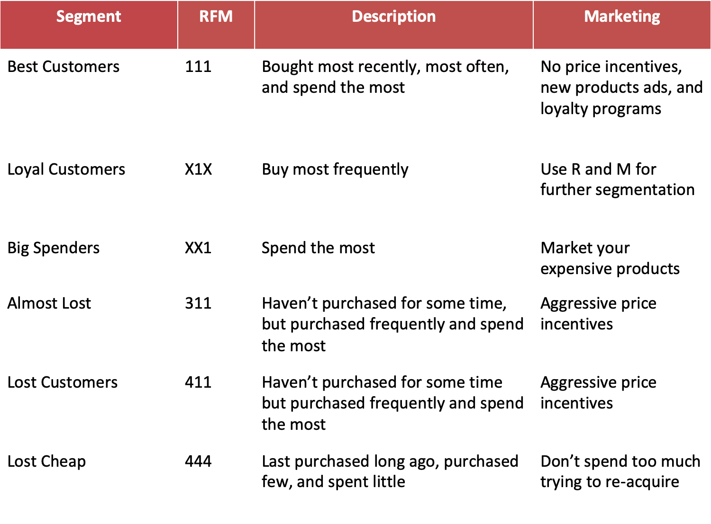


```python
import numpy as np
import pandas as pd
import seaborn as sns
import matplotlib.pyplot as plt
```


```python
from pyspark.sql import SparkSession
spark = SparkSession.builder \
    .master("local") \
    .appName("RFM Analysis") \
    .config("spark.some.config.option", "some-value") \
    .getOrCreate()
```


```python
df = spark.read.format('com.databricks.spark.csv').\
    options(header='true', \
    inferschema='true').\
    load("/Users/Devi/Documents/Purwadhika/awal/onlineretail.csv")
df.show(5)
```

    +---------+---------+--------------------+--------+------------+---------+----------+--------------+
    |InvoiceNo|StockCode|         Description|Quantity| InvoiceDate|UnitPrice|CustomerID|       Country|
    +---------+---------+--------------------+--------+------------+---------+----------+--------------+
    |   536365|   85123A|WHITE HANGING HEA...|       6|12/1/10 8:26|     2.55|     17850|United Kingdom|
    |   536365|    71053| WHITE METAL LANTERN|       6|12/1/10 8:26|     3.39|     17850|United Kingdom|
    |   536365|   84406B|CREAM CUPID HEART...|       8|12/1/10 8:26|     2.75|     17850|United Kingdom|
    |   536365|   84029G|KNITTED UNION FLA...|       6|12/1/10 8:26|     3.39|     17850|United Kingdom|
    |   536365|   84029E|RED WOOLLY HOTTIE...|       6|12/1/10 8:26|     3.39|     17850|United Kingdom|
    +---------+---------+--------------------+--------+------------+---------+----------+--------------+
    only showing top 5 rows
    


```python
df.printSchema()
```

    root
     |-- InvoiceNo: string (nullable = true)
     |-- StockCode: string (nullable = true)
     |-- Description: string (nullable = true)
     |-- Quantity: integer (nullable = true)
     |-- InvoiceDate: string (nullable = true)
     |-- UnitPrice: double (nullable = true)
     |-- CustomerID: integer (nullable = true)
     |-- Country: string (nullable = true)
    


```python
print('\n Shape =', (df.count(), len(df.columns)))
```

    
     Shape = (541909, 8)


```python
%matplotlib inline
from pyspark.sql import functions as F
## Check for missing value
ax=plt.subplot(111)
sns.heatmap(df.select([F.isnull(c) for c in df.columns]).collect(),cbar=False,cmap='Greys_r')
ax.set_xticklabels(df.columns, rotation='vertical',fontsize=7)
plt.title('Missing Value Occurrence')
plt.show()
```


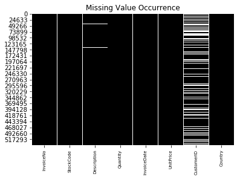


```python
## Delete rows with null value
from pyspark.sql.functions import count
def data_count(inp):
    inp.agg(*[count(i).alias(i) for i in inp.columns]).show()  
data_count(df) # raw data
df_new = df.dropna(how='any') 
data_count(df_new) # after we drop rows with null values
```

    +---------+---------+-----------+--------+-----------+---------+----------+-------+
    |InvoiceNo|StockCode|Description|Quantity|InvoiceDate|UnitPrice|CustomerID|Country|
    +---------+---------+-----------+--------+-----------+---------+----------+-------+
    |   541909|   541909|     540455|  541909|     541909|   541909|    406829| 541909|
    +---------+---------+-----------+--------+-----------+---------+----------+-------+
    
    +---------+---------+-----------+--------+-----------+---------+----------+-------+
    |InvoiceNo|StockCode|Description|Quantity|InvoiceDate|UnitPrice|CustomerID|Country|
    +---------+---------+-----------+--------+-----------+---------+----------+-------+
    |   406829|   406829|     406829|  406829|     406829|   406829|    406829| 406829|
    +---------+---------+-----------+--------+-----------+---------+----------+-------+
    


```python
## Change datetime format
from pyspark.sql.functions import to_utc_timestamp, unix_timestamp, lit, datediff, col 
time_format = "MM/dd/yy HH:mm"
df_new = df_new.withColumn('NewInvoiceDate', to_utc_timestamp(unix_timestamp(col('InvoiceDate'),time_format).cast('timestamp'),'UTC'))  
df_new.show(5)
```

    +---------+---------+--------------------+--------+------------+---------+----------+--------------+-------------------+
    |InvoiceNo|StockCode|         Description|Quantity| InvoiceDate|UnitPrice|CustomerID|       Country|     NewInvoiceDate|
    +---------+---------+--------------------+--------+------------+---------+----------+--------------+-------------------+
    |   536365|   85123A|WHITE HANGING HEA...|       6|12/1/10 8:26|     2.55|     17850|United Kingdom|2010-12-01 08:26:00|
    |   536365|    71053| WHITE METAL LANTERN|       6|12/1/10 8:26|     3.39|     17850|United Kingdom|2010-12-01 08:26:00|
    |   536365|   84406B|CREAM CUPID HEART...|       8|12/1/10 8:26|     2.75|     17850|United Kingdom|2010-12-01 08:26:00|
    |   536365|   84029G|KNITTED UNION FLA...|       6|12/1/10 8:26|     3.39|     17850|United Kingdom|2010-12-01 08:26:00|
    |   536365|   84029E|RED WOOLLY HOTTIE...|       6|12/1/10 8:26|     3.39|     17850|United Kingdom|2010-12-01 08:26:00|
    +---------+---------+--------------------+--------+------------+---------+----------+--------------+-------------------+
    only showing top 5 rows
    


```python
## Calculate total price and create the column
from pyspark.sql.functions import round
df_new = df_new.withColumn('TotalPrice', round( df.Quantity * df.UnitPrice, 2 ))
```


```python
## Calculate time diff
from pyspark.sql.functions import mean, min, max, sum
date_max = df_new.select(max('NewInvoiceDate')).toPandas()
```


```python
## Calculate duration
df_new = df_new.withColumn('Duration', datediff(lit(date_max.iloc[0][0]), 'NewInvoiceDate')) 
df_new.show(5)
```

    +---------+---------+--------------------+--------+------------+---------+----------+--------------+-------------------+----------+--------+
    |InvoiceNo|StockCode|         Description|Quantity| InvoiceDate|UnitPrice|CustomerID|       Country|     NewInvoiceDate|TotalPrice|Duration|
    +---------+---------+--------------------+--------+------------+---------+----------+--------------+-------------------+----------+--------+
    |   536365|   85123A|WHITE HANGING HEA...|       6|12/1/10 8:26|     2.55|     17850|United Kingdom|2010-12-01 08:26:00|      15.3|     373|
    |   536365|    71053| WHITE METAL LANTERN|       6|12/1/10 8:26|     3.39|     17850|United Kingdom|2010-12-01 08:26:00|     20.34|     373|
    |   536365|   84406B|CREAM CUPID HEART...|       8|12/1/10 8:26|     2.75|     17850|United Kingdom|2010-12-01 08:26:00|      22.0|     373|
    |   536365|   84029G|KNITTED UNION FLA...|       6|12/1/10 8:26|     3.39|     17850|United Kingdom|2010-12-01 08:26:00|     20.34|     373|
    |   536365|   84029E|RED WOOLLY HOTTIE...|       6|12/1/10 8:26|     3.39|     17850|United Kingdom|2010-12-01 08:26:00|     20.34|     373|
    +---------+---------+--------------------+--------+------------+---------+----------+--------------+-------------------+----------+--------+
    only showing top 5 rows
    


```python
## Calculate rfm
recency = df_new.groupBy('CustomerID').agg(min('Duration').alias('Recency'))
frequency = df_new.groupBy('CustomerID', 'InvoiceNo').count().groupBy('CustomerID').agg(count("*").alias("Frequency"))
monetary = df_new.groupBy('CustomerID').agg(round(sum('TotalPrice'), 2).alias('Monetary'))
rfm = recency.join(frequency,'CustomerID', how = 'inner').join(monetary,'CustomerID', how = 'inner')
rfm.show(5)
rfm.describe().show()
# # rfm.toPandas().to_csv('rfm_value.csv',index=False)
```

    +----------+-------+---------+--------+
    |CustomerID|Recency|Frequency|Monetary|
    +----------+-------+---------+--------+
    |     15619|     10|        1|   336.4|
    |     17389|      0|       43|31300.08|
    |     12940|     46|        4|  876.29|
    |     13623|     30|        7|  672.44|
    |     14450|    180|        3|  483.25|
    +----------+-------+---------+--------+
    only showing top 5 rows
    
    +-------+------------------+------------------+-----------------+------------------+
    |summary|        CustomerID|           Recency|        Frequency|          Monetary|
    +-------+------------------+------------------+-----------------+------------------+
    |  count|              4372|              4372|             4372|              4372|
    |   mean|15299.677721866423| 91.58119853613907| 5.07548032936871|1898.4597003659658|
    | stddev|1722.3907054276908|100.77213931384833|9.338754163574729| 8219.345141139722|
    |    min|             12346|                 0|                1|          -4287.63|
    |    max|             18287|               373|              248|         279489.02|
    +-------+------------------+------------------+-----------------+------------------+
    


```python
## Cutting point
def describe_quintile(df_in, columns):
    quintiles = [25, 50, 75]
    quars = np.transpose([np.percentile(df_in.select(x).collect(),quintiles) for x in columns])
    quars = pd.DataFrame(quars, columns=columns)
    quars['quintile'] = [str(p) + '%' for p in quintiles]
    new_df = quars
    new_df = new_df.set_index('quintile')
    new_df = new_df.round(2)
    return new_df
cols = ['Recency','Frequency','Monetary']
df_quar = describe_quintile(rfm,cols)
print(df_quar)
```

              Recency  Frequency  Monetary
    quintile                              
    25%          16.0        1.0    293.36
    50%          50.0        3.0    648.08
    75%         143.0        5.0   1611.72


```python
def RScore(x):
    rs=0
    for i in range(3):
        if x <= df_quar.iloc[i,0]:
            rs=i+1
            break
        elif x > df_quar.iloc[2,0]:
            rs=4
            break
    return rs
```


```python
def FScore(x):
    fs=4
    for i in range(3):
        if x <= df_quar.iloc[i,1]:
            fs-=i
            break
        elif x > df_quar.iloc[2,1]:
            fs=1
            break
    return fs
```


```python
def MScore(x):
    ms=4
    for i in range(3):
        if x <= df_quar.iloc[i,2]:
            ms-=i
            break
        elif x > df_quar.iloc[2,2]:
            ms=1
            break
    return ms
```


```python
from pyspark.sql.functions import udf 
from pyspark.sql.types import IntegerType
R_udf = udf(lambda x: RScore(x), IntegerType())
F_udf = udf(lambda x: FScore(x), IntegerType())
M_udf = udf(lambda x: MScore(x), IntegerType())
```


```python
##segmentation
rfm_seg=rfm.withColumn('r_seg',R_udf('Recency'))
# rfm_seg.show(5)
rfm_seg=rfm_seg.withColumn('f_seg',F_udf('Frequency'))
# rfm_seg.show(5)
rfm_seg=rfm_seg.withColumn('m_seg',M_udf('Monetary'))
# rfm_seg.show(5)
rfm_seg=rfm_seg.withColumn('RFMScore',F.concat(F.col('r_seg'),F.col('f_seg'),F.col('m_seg')))
rfm_seg.sort(F.col('RFMScore')).show(5)
# # rfm_seg.toPandas().to_csv('rfm_score.csv',index=False)
```

    +----------+-------+---------+--------+-----+-----+-----+--------+
    |CustomerID|Recency|Frequency|Monetary|r_seg|f_seg|m_seg|RFMScore|
    +----------+-------+---------+--------+-----+-----+-----+--------+
    |     17754|      0|        6| 1739.92|    1|    1|    1|     111|
    |     18161|     10|        6| 1612.79|    1|    1|    1|     111|
    |     12471|      2|       49|18740.92|    1|    1|    1|     111|
    |     15727|     16|        7| 5178.96|    1|    1|    1|     111|
    |     17389|      0|       43|31300.08|    1|    1|    1|     111|
    +----------+-------+---------+--------+-----+-----+-----+--------+
    only showing top 5 rows
    


```python
# grp = 'RFMScore'
# num_cols = ['Recency','Frequency','Monetary']
# df_input = rfm_seg
# def quintile_agg(df_in,gr,colm):
#     qua=df_in.groupBy(gr).agg(*[mean(F.col(i)) for i in colm]).sort(F.col(gr))
#     return qua
# quintile_grouped = quintile_agg(df_input,grp,num_cols)
# quintile_grouped.show(5)
# # quintile_grouped.toPandas().to_csv('quintile_grouped.csv',index=False)#output_dir+'quintile_grouped.csv')
```


```python
## prepare the data in vector dense
from pyspark.ml.linalg import Vectors
def transData(data):
    return data.rdd.map(lambda r: [r[0],Vectors.dense(r[1:])]).toDF(['CustomerID','rfm']) #Return a new RDD by applying a function to each element of this RDD.
transformed=transData(rfm)
transformed.show(5)
```

    +----------+-------------------+
    |CustomerID|                rfm|
    +----------+-------------------+
    |     15619|   [10.0,1.0,336.4]|
    |     17389|[0.0,43.0,31300.08]|
    |     12940|  [46.0,4.0,876.29]|
    |     13623|  [30.0,7.0,672.44]|
    |     14450| [180.0,3.0,483.25]|
    +----------+-------------------+
    only showing top 5 rows
    


```python
## normalization
from pyspark.ml.feature import MinMaxScaler
scaler = MinMaxScaler(inputCol="rfm",outputCol="features")
scalerModel = scaler.fit(transformed)
scaledData = scalerModel.transform(transformed)
scaledData.show(5,False) # results will not be truncated
```

    +----------+-------------------+---------------------------------------------------------------+
    |CustomerID|rfm                |features                                                       |
    +----------+-------------------+---------------------------------------------------------------+
    |15619     |[10.0,1.0,336.4]   |[0.02680965147453083,0.0,0.016294610567853272]                 |
    |17389     |[0.0,43.0,31300.08]|[0.0,0.1700404858299595,0.12540746393334334]                   |
    |12940     |[46.0,4.0,876.29]  |[0.12332439678284182,0.012145748987854251,0.01819712791732512] |
    |13623     |[30.0,7.0,672.44]  |[0.08042895442359249,0.024291497975708502,0.017478781288030567]|
    |14450     |[180.0,3.0,483.25] |[0.48257372654155495,0.008097165991902834,0.01681209500499777] |
    +----------+-------------------+---------------------------------------------------------------+
    only showing top 5 rows
    


```python
###ML
## find optimal parameter
from pyspark.ml.clustering import KMeans
cost = np.zeros(10)
for k in range(2,10):
    kmeans = KMeans().setK(k)\
        .setSeed(1) \
        .setFeaturesCol("features")\
        .setPredictionCol("cluster")
    model = kmeans.fit(scaledData)
    cost[k] = model.computeCost(scaledData) #sse
```


```python
## plot elbow
fig, ax = plt.subplots(1,1, figsize =(8,6))
ax.plot(range(2,10),cost[2:10], marker = "o",color='indianred')
plt.title('Elbow Method for Optimal K')
ax.spines['right'].set_visible(False)
ax.spines['top'].set_visible(False)
ax.set_xlabel('K')
ax.set_ylabel('Cost')
plt.show()
```


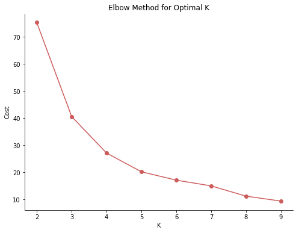


```python
# ## Silhouette method
from pyspark.ml.evaluation import ClusteringEvaluator
k_min=3
k_max=10
k_lst = np.arange(k_min, k_max+1)
silh_lst = []
for k in k_lst:
# Trains a k-means model
  kmeans = KMeans().setK(k).setSeed(int(np.random.randint(100, size=1)))
  model = kmeans.fit(scaledData)
# Make predictions
  predictions = model.transform(scaledData)
# Evaluate clustering by computing Silhouette score
  evaluator = ClusteringEvaluator()
  silhouette = evaluator.evaluate(predictions)
  silh_lst.append(silhouette)
silhouette = pd.DataFrame(list(zip(k_lst,silh_lst)),columns = ['k','silhouette'])
spark.createDataFrame(silhouette).show()
```

    +---+------------------+
    |  k|        silhouette|
    +---+------------------+
    |  3| 0.806659969397374|
    |  4|0.7003095060284757|
    |  5|0.7391492869094136|
    |  6|0.5241799434048069|
    |  7|0.6589654082227276|
    |  8|0.7116442299590126|
    |  9|0.5940966739882402|
    | 10|0.6626462416261224|
    +---+------------------+
    


```python
# ### Kmeans
k = 3
kmeans = KMeans().setK(k).setSeed(1)
model = kmeans.fit(scaledData)
# Make predictions
predictions = model.transform(scaledData)
predictions.show(5,False)
# # center
# center=model.clusterCenters()
# print(center)
# print(center[1])
## predictions.toPandas().to_csv('kmeans_rfm.csv',index=False)
```

    +----------+-------------------+---------------------------------------------------------------+----------+
    |CustomerID|rfm                |features                                                       |prediction|
    +----------+-------------------+---------------------------------------------------------------+----------+
    |15619     |[10.0,1.0,336.4]   |[0.02680965147453083,0.0,0.016294610567853272]                 |0         |
    |17389     |[0.0,43.0,31300.08]|[0.0,0.1700404858299595,0.12540746393334334]                   |0         |
    |12940     |[46.0,4.0,876.29]  |[0.12332439678284182,0.012145748987854251,0.01819712791732512] |0         |
    |13623     |[30.0,7.0,672.44]  |[0.08042895442359249,0.024291497975708502,0.017478781288030567]|0         |
    |14450     |[180.0,3.0,483.25] |[0.48257372654155495,0.008097165991902834,0.01681209500499777] |2         |
    +----------+-------------------+---------------------------------------------------------------+----------+
    only showing top 5 rows
    


```python
## extract scaled rfm to different columns
def extract(row):
    return (row.CustomerID, ) + tuple(row.features.toArray().tolist()) +(row.prediction,)
d_sc=predictions.rdd.map(extract).toDF(["CustomerID",'r_sca','f_sca','m_sca','prediction']) 
d_sc.show(5)
from pyspark.sql.functions import *
df1 = d_sc.alias('df1')
df2 = rfm_seg.alias('df2')
df_baru=df1.join(df2, df1.CustomerID == df2.CustomerID).select('df1.*','df2.RFMScore')
df_baru.show(5)
# # df_baru.toPandas().to_csv('rfmkmean.csv',index=False)
```

    +----------+-------------------+--------------------+--------------------+----------+
    |CustomerID|              r_sca|               f_sca|               m_sca|prediction|
    +----------+-------------------+--------------------+--------------------+----------+
    |     15619|0.02680965147453083|                 0.0|0.016294610567853272|         0|
    |     17389|                0.0|  0.1700404858299595| 0.12540746393334334|         0|
    |     12940|0.12332439678284182|0.012145748987854251| 0.01819712791732512|         0|
    |     13623|0.08042895442359249|0.024291497975708502|0.017478781288030567|         0|
    |     14450|0.48257372654155495|0.008097165991902834| 0.01681209500499777|         2|
    +----------+-------------------+--------------------+--------------------+----------+
    only showing top 5 rows
    
    +----------+--------------------+--------------------+--------------------+----------+--------+
    |CustomerID|               r_sca|               f_sca|               m_sca|prediction|RFMScore|
    +----------+--------------------+--------------------+--------------------+----------+--------+
    |     13098|0.002680965147453083| 0.16194331983805668| 0.11610014425076905|         0|     111|
    |     13248|  0.3324396782841823|0.004048582995951417| 0.01675018011524204|         2|     333|
    |     13452|  0.6943699731903485|0.004048582995951417| 0.01718827112801564|         1|     433|
    |     13460|  0.0777479892761394|0.004048582995951417|0.015755595113269537|         0|     234|
    |     13518| 0.22788203753351208|                 0.0|0.017432970612627923|         0|     342|
    +----------+--------------------+--------------------+--------------------+----------+--------+
    only showing top 5 rows
    


```python
from mpl_toolkits.mplot3d import axes3d
```


```python
df_p=df_baru.rdd.sample(False,0.5,seed=1000)
df_p=spark.createDataFrame(df_p)
df_p.printSchema()
```

    root
     |-- CustomerID: long (nullable = true)
     |-- r_sca: double (nullable = true)
     |-- f_sca: double (nullable = true)
     |-- m_sca: double (nullable = true)
     |-- prediction: long (nullable = true)
     |-- RFMScore: string (nullable = true)
    


```python
def XScore(x):
    xs=0
    if x == '111':
        xs=0
    elif x in ('112','113','114','212','213','214','312','313','314','412','413','414'):
        xs=1
    elif x in ('121','131','141','211','221','231','241','321','331','341','421','431','441'):
        xs=2
    elif x == '331':
        xs=3
    elif x == '411':
        xs=4
    elif x == '444':
        xs=5
    else:
        xs=6
    return xs
```


```python
from pyspark.sql.functions import udf 
from pyspark.sql.types import IntegerType
X_udf = udf(lambda x: XScore(x), IntegerType())
```


```python
df_p=df_p.withColumn('rfm_class',X_udf('RFMScore'))
df_p.show()
df_plot=df_p.select('*').toPandas()
# # df_plot.to_csv('rfm_kmeans_pred.csv',index=False)
```

    +----------+--------------------+--------------------+--------------------+----------+--------+---------+
    |CustomerID|               r_sca|               f_sca|               m_sca|prediction|RFMScore|rfm_class|
    +----------+--------------------+--------------------+--------------------+----------+--------+---------+
    |     13248|  0.3324396782841823|0.004048582995951417| 0.01675018011524204|         2|     333|        6|
    |     13452|  0.6943699731903485|0.004048582995951417| 0.01718827112801564|         1|     433|        6|
    |     13460|  0.0777479892761394|0.004048582995951417|0.015755595113269537|         0|     234|        6|
    |     13638|0.040214477211796246|                 0.0|0.015541342108309476|         0|     144|        6|
    |     13723|  0.5817694369973191|                 0.0|0.015813422281220107|         2|     444|        5|
    |     14117| 0.38337801608579086|                 0.0|0.015426322074067756|         2|     344|        6|
    |     15057|  0.7372654155495979|0.004048582995951417|0.020358017476067886|         1|     432|        6|
    |     15194| 0.00804289544235925| 0.08502024291497975| 0.04161300797651955|         0|     111|        0|
    |     15322| 0.17158176943699732|0.004048582995951417| 0.01723397608647505|         0|     333|        6|
    |     15437|  0.7024128686327078|                 0.0|0.015814514689633553|         1|     444|        5|
    |     16597|0.010723860589812333|                 0.0|0.015426463029992073|         0|     144|        6|
    |     17499|   0.774798927613941|                 0.0|0.017304136897803253|         1|     443|        6|
    |     17979|  0.0938337801608579|0.016194331983805668|0.017709138507343715|         0|     222|        6|
    |     18147| 0.12064343163538874|0.004048582995951417|0.015741147131027165|         0|     234|        6|
    |     18196|  0.2546916890080429|0.004048582995951417| 0.01753759514745135|         2|     332|        6|
    |     12936|0.045576407506702415|0.016194331983805668| 0.01867852763784476|         0|     222|        6|
    |     13299|  0.7184986595174263|                 0.0|0.015611326724732285|         1|     444|        5|
    |     15921| 0.46112600536193027|                 0.0| 0.01629330672555335|         2|     443|        6|
    |     16781|  0.9785522788203753|0.004048582995951417|0.016147487821848622|         1|     433|        6|
    |     18117| 0.06702412868632708|                 0.0| 0.01623935584552147|         0|     243|        6|
    +----------+--------------------+--------------------+--------------------+----------+--------+---------+
    only showing top 20 rows
    


```python
'''
Plot raw data; From the figure shown, there are some data that suprisingly dispersed a little too far from others, better exclude them
to get better data visualization
'''
j=plt.subplot2grid((1,1),(0,0),projection='3d')
j.scatter(xs=df_plot['r_sca'],ys=df_plot['f_sca'],zs=df_plot['m_sca'],s=30, c='indianred')
j.set_xlabel('R')
j.set_ylabel('F')
j.set_zlabel('M')
# j.set_ylim3d(0,0.2)
# j.set_zlim3d(0,0.2)
plt.title('Raw Data').set_position([.5, 1])
plt.show()
```


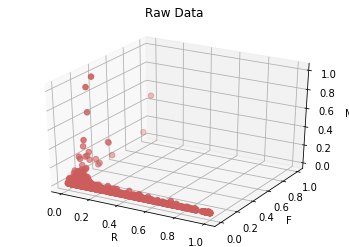


```python
j=plt.subplot2grid((1,1),(0,0),projection='3d')
j.scatter(xs=df_plot['r_sca'],ys=df_plot['f_sca'],zs=df_plot['m_sca'],s=30, c='indianred')
j.set_xlabel('R')
j.set_ylabel('F')
j.set_zlabel('M')
j.set_ylim3d(0,0.2)
j.set_zlim3d(0,0.2)
plt.title('Raw Data (Subtracted)').set_position([.5, 1])
plt.show()
```


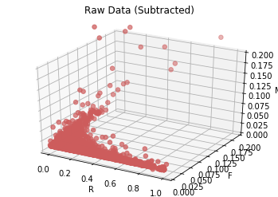


```python
'''
PLOTTING RFM_Analysis

if we  want to make the chart full length, turn ylim/xlim command to comment
'''
color_plot={0:'maroon',1:'indianred',2:'darkgray',3:'mediumvioletred',4:'goldenrod',5:'teal',6:'dimgray'}
cust_label={0:'Best Customers',1:'Loyal Customers',2:'Big Spenders',3:'Almost Lost',4:'Lost Customers',5:'Lost Cheap',6:'Others'}

for c in color_plot: # iterate over color dictionary keys
        df_temp = df_plot[df_plot['rfm_class'] == c]
        plt.scatter(x = 'r_sca', y = 'f_sca', 
            data = df_temp,  
            color=color_plot[c],label=cust_label[c])
plt.xlabel('R')
plt.ylabel('F')
plt.legend()
plt.title('Cluster of Customers - RF (Subtracted)')
plt.ylim(0,0.2)
plt.show()
```


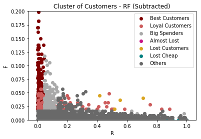


```python
for c in color_plot: # iterate over color dictionary keys
        df_temp = df_plot[df_plot['rfm_class'] == c]  
        plt.scatter(x = 'r_sca', y = 'm_sca', 
            data = df_temp,  
            color=color_plot[c],label=cust_label[c])
plt.xlabel('R')
plt.ylabel('M')
plt.legend()
plt.title('Cluster of Customers - RM (Subtracted)')
plt.ylim(0,0.2)
plt.show()
```


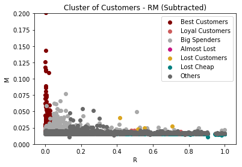


```python
for c in color_plot: # iterate over color dictionary keys
        df_temp = df_plot[df_plot['rfm_class'] == c]
        plt.scatter(x = 'f_sca', y = 'm_sca', 
            data = df_temp,  
            color=color_plot[c],label=cust_label[c])
plt.xlabel('F')
plt.ylabel('M')
plt.legend()
plt.title('Cluster of Customers - FM (Subtracted)')
plt.xlim(0,0.2)
plt.ylim(0,0.2)
plt.show()
```


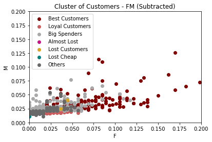


```python
plt.figure(figsize=(10,7))
j=plt.subplot2grid((1,1),(0,0),projection='3d')
for c in color_plot: # iterate over color dictionary keys
    df_temp = df_plot[df_plot['rfm_class'] == c]
    print('number of segment',cust_label[c],'is',len(df_temp))
    j.scatter(xs=df_temp['r_sca'],ys=df_temp['f_sca'],zs=df_temp['m_sca'],s=30, c=color_plot[c],label=cust_label[c])
j.set_xlabel('R')
j.set_ylabel('F')
j.set_zlabel('M')
j.set_ylim3d(0,0.2)
j.set_zlim3d(0,0.2)
plt.title('Cluster of Customers based on RFM Analysis - Subtracted').set_position([.5, 1])
plt.legend(loc=1)
plt.show()
```

    number of segment Best Customers is 244
    number of segment Loyal Customers is 141
    number of segment Big Spenders is 266
    number of segment Almost Lost is 0
    number of segment Lost Customers is 4
    number of segment Lost Cheap is 196
    number of segment Others is 1371


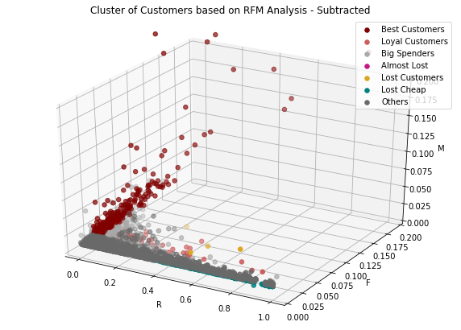


```python
'''
PLOTTING K-MEANS

if we  want to make the chart full length, turn ylim/xlim command to comment
'''
color_plot={0:'maroon',1:'dimgray',2:'darkgray'}
cust_label={0:'Cluster 1',1:'Cluster 2',2:'Cluster 3'}

for c in color_plot: # iterate over color dictionary keys
        df_temp = df_plot[df_plot['prediction'] == c]
        plt.scatter(x = 'r_sca', y = 'f_sca', 
            data = df_temp,  
            color=color_plot[c],label=cust_label[c])
plt.xlabel('R')
plt.ylabel('F')
plt.legend()
plt.title('Cluster of Customers using Kmeans - RF (Subtracted)')
plt.ylim(0,0.2)
plt.show()
```


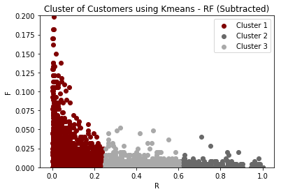


```python
for c in color_plot: # iterate over color dictionary keys
        df_temp = df_plot[df_plot['prediction'] == c]
        plt.scatter(x = 'r_sca', y = 'm_sca', 
            data = df_temp,  
            color=color_plot[c],label=cust_label[c])
plt.xlabel('R')
plt.ylabel('M')
plt.legend()
plt.title('Cluster of Customers using Kmeans - RM (Subtracted)')
plt.ylim(0,0.2)
plt.show()
```


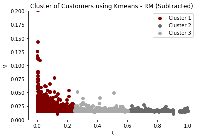


```python
for c in color_plot: # iterate over color dictionary keys
        df_temp = df_plot[df_plot['prediction'] == c]
        plt.scatter(x = 'f_sca', y = 'm_sca', 
            data = df_temp,  
            color=color_plot[c],label=cust_label[c])
plt.xlabel('F')
plt.ylabel('M')
plt.legend()
plt.title('Cluster of Customers using Kmeans - FM (Subtracted)')
plt.ylim(0,0.2)
plt.xlim(0,0.2)
plt.show()
```


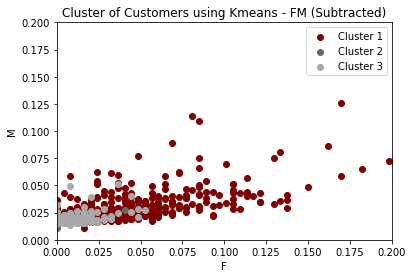


```python
plt.figure(figsize=(10,7))
j=plt.subplot2grid((1,1),(0,0),projection='3d')
for c in color_plot: # iterate over color dictionary keys
    df_temp = df_plot[df_plot['prediction'] == c]
    print('number of',cust_label[c],'is',len(df_temp))
    j.scatter(xs=df_temp['r_sca'],ys=df_temp['f_sca'],zs=df_temp['m_sca'],s=30, c=color_plot[c],label=cust_label[c])
j.set_xlabel('R')
j.set_ylabel('F')
j.set_zlabel('M')
j.set_ylim3d(0,0.2)
j.set_zlim3d(0,0.2)
plt.title('Cluster of Customers using Kmeans - Subtracted').set_position([.5, 1])
plt.legend(loc=1)
plt.show()
```

    number of Cluster 1 is 1486
    number of Cluster 2 is 316
    number of Cluster 3 is 420


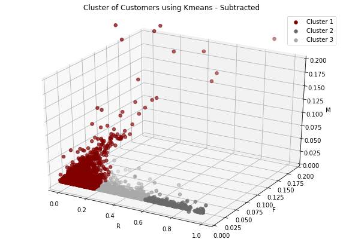


